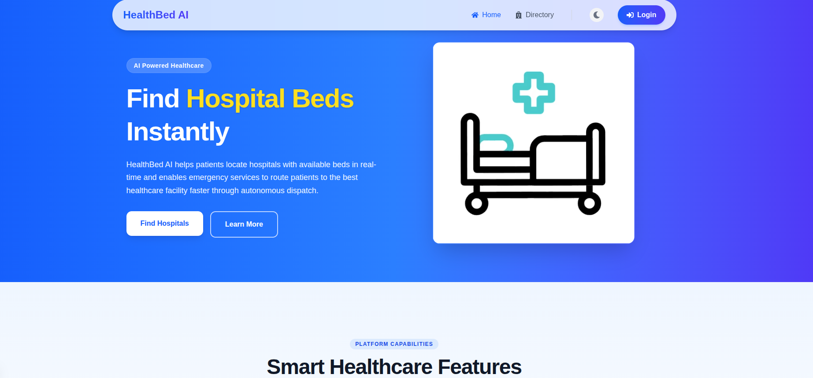

<div align="center">
  
  <br/>
  
</div>

# HealthBed AI: Live Hospital Bed & Emergency Dispatch System

HealthBed AI is an advanced, full-stack Hospital Management and Emergency Routing web application designed to reduce operational friction during medical crises.

Built with a Node.js/Express backend, PostgreSQL database, Python AI Microservice, and a Next.js with Tailwind CSS frontend, the platform leverages WebSockets (Socket.io) for low-latency live medical data broadcasting and Pessimistic Database Locking to securely prevent double-booking of critical beds.

---

## Technical Overview

### 1. Real-Time Bed & Ward Tracking (WebSockets)
- **Dynamic Ward Management:** Hospital Administrators can dynamically register and track specialized units (e.g., Maternity, Burn Unit, CCU, NICU, Trauma) using JSONB data storage in PostgreSQL.
- **Microsecond Synchronization:** When an administrator adjusts bed availability, Socket.io broadcasts the new capacity to every connected client, ensuring the public patient directory updates in real-time.

### 2. Autonomous Emergency Dispatch System
- **Public Dispatch Initiation:** Users can initiate an emergency dispatch signal (including Patient Name, Condition, and ETA) directly to a specified hospital.
- **Active Alerting:** The moment a dispatch is requested, an incoming alert is transmitted to the target Hospital Administrator's dashboard.
- **Concurrency-Safe Reservations:** Administrators can lock and reserve a bed for the incoming ambulance. The system utilizes PostgreSQL `FOR UPDATE` pessimistic locking to ensure safe concurrency and prevent bed overbooking.

### 3. AI-Assisted Routing Protocol
- Integrates with an internal Python microservice to compute optimal hospital routing based on live distance, location coordinates, and real-time bed capacity.

### 4. Interactive User Interface
- Built with Framer Motion for optimized micro-animations and smooth transitions.
- Modern interface utilizing glassmorphism styling and custom theming for an intuitive administrative experience.

---

## Project Architecture & Modules

This repository is structured into three decoupled services. Refer to the specific module documentation for technical implementation details:

- **[`/frontend` README](frontend/README.md)**: The Next.js reactive UI application.
- **[`/backend` README](backend/README.md)**: The RESTful API layer and WebSocket server (Uses PostgreSQL).
- **[`/ai-service` README](ai-service/README.md)**: The Python FastAPI routing engine.
- **`/database`**: Contains `schema.sql` and `seed-data.sql` for automated local environment initialization.

---

## Technical Documentation

Explore the technical implementation details of HealthBed AI:
1. **[System Architecture & Data Flow](docs/architecture.md)** — Architectural overview of the WebSocket event bus topology and real-time synchronization flows.
2. **[System Design & Core Mechanisms](docs/system-design.md)** — Detailed analysis of the Pessimistic Locking database strategy and dynamic JSONB capacity engine.
3. **[API Documentation](docs/api-docs.md)** — Comprehensive reference for the RESTful endpoints.

---

## Local Development Setup

### 1. Database Configuration
1. Ensure PostgreSQL is installed and running on port `5432`.
2. Create a database named `hospital_bed_db`.
3. Execute the initialization scripts from the `/database` directory:
   ```bash
   psql -U postgres -d hospital_bed_db -f database/schema.sql
   psql -U postgres -d hospital_bed_db -f database/seed-data.sql
   ```

### 2. Backend API Setup
1. Navigate to the backend directory:
   ```bash
   cd backend
   npm install
   ```
2. Create a `.env` file in the `backend` folder (reference `.env.example`).
3. Start the backend development server:
   ```bash
   npm run dev
   ```

### 3. Frontend UI Setup
1. Navigate to the frontend directory:
   ```bash
   cd frontend
   npm install
   ```
2. Create a `.env.local` file in the `frontend` folder:
   ```
   NEXT_PUBLIC_API_URL=http://localhost:5000
   ```
3. Start the Next.js development server:
   ```bash
   npm run dev
   ```

### 4. AI Service Setup
Refer to [ai-service/README.md](ai-service/README.md) for instructions on running the FastAPI routing engine via `uvicorn`.

---

## Test Credentials

Navigate to `http://localhost:3000/auth/login` to access the platform.

> **Note:** For security reasons, default passwords are not included in this repository. If you are setting up the project locally for the first time, you must generate your own bcrypt hashes in `database/seed-data.sql` or create an account via the Signup interface.
