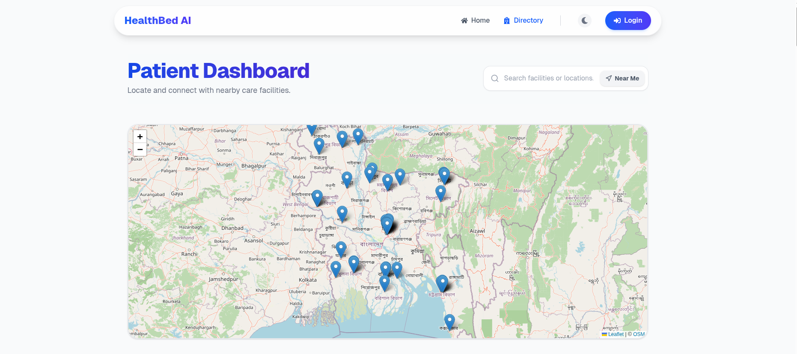
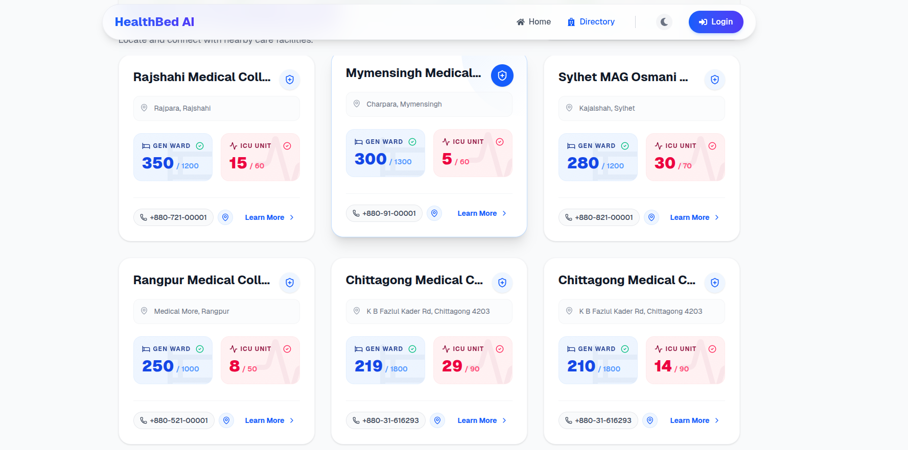
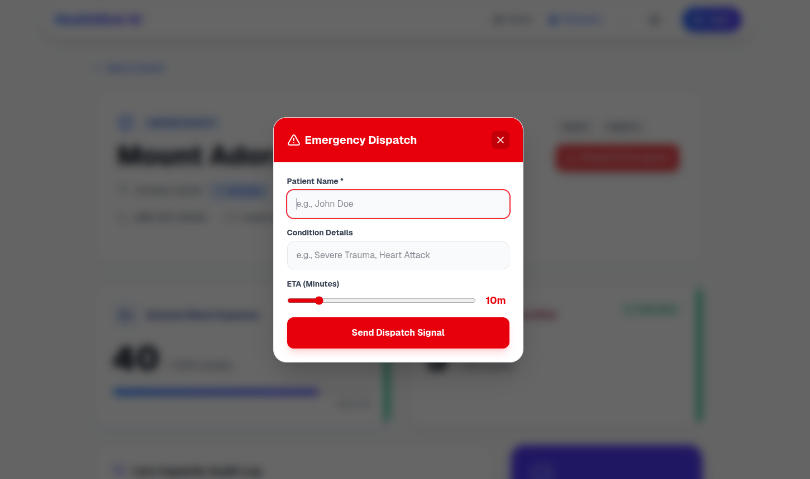
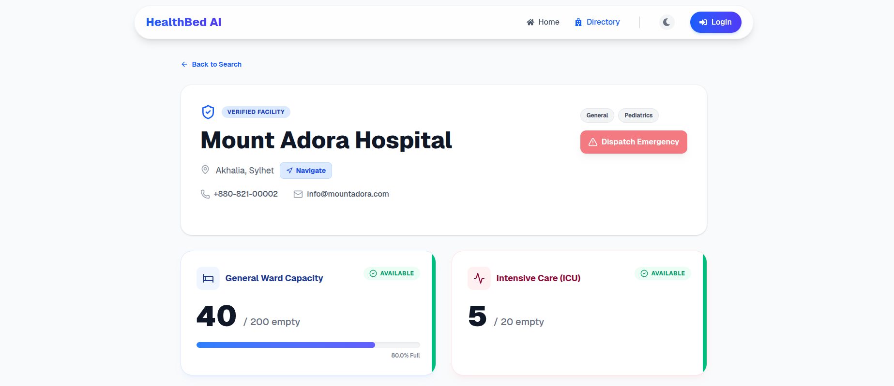

<div align="center">
  
  <br/>
  
</div>

# HealthBed AI: Live Hospital Bed & Emergency Dispatch System 🏥⚡

This project is a highly advanced, full-stack Hospital Management & Emergency Routing web application designed to eliminate operational friction during medical crises. 

Built with a **Node.js/Express backend**, **PostgreSQL database**, **Python AI Microservice**, and a stunning **Next.js & Tailwind CSS frontend**, the platform leverages **WebSockets (Socket.io)** for millisecond-accurate live medical data broadcasting and **Pessimistic Database Locking** to securely prevent double-booking of life-critical beds.

---

## 📷 Platform Previews

### 1. Find the Nearest Hospitals



### 2. Request Emergency Dispatch


### 3. Detailed Hospital Insights



---

## 🚀 Core Features & Capabilities

### 1. Real-Time Bed & Ward Tracking (WebSockets)
- **Dynamic Ward Management:** Hospital Admins can dynamically register and track specialized units (e.g., *Maternity, Burn Unit, CCU, NICU, Trauma*) completely on the fly using advanced JSONB data storage in PostgreSQL.
- **Millisecond Sync:** When an admin adjusts bed availability, `Socket.io` instantly blasts the new capacity to every open browser—meaning the public patient directory updates in real-time without refreshing.

### 2. Autonomous Emergency Dispatch System
- **Public Dispatch Initiation:** From the public directory, users can instantly fire an emergency dispatch signal (including Patient Name, Condition, and ETA) directly to a specific hospital.
- **Pulsing Neon Alerts:** The exact second a dispatch is requested, a red flashing incoming alert strikes the target Hospital Admin's dashboard.
- **Concurrency-Safe Reservations:** Admins can lock and reserve a bed for the incoming ambulance. Under the hood, the system uses Postgres `FOR UPDATE` pessimistic locking so two dispatchers can never accidentally overbook the last remaining bed.

### 3. AI-Assisted Routing Protocol
- Integrates with an internal Python microservice to instantly compute the best hospital routing based on live distance/location coordinates and real-time live bed capacity.

### 4. Interactive & Premium User Interface
- Built with **Framer Motion** for liquid-smooth micro-animations.
- **Beautiful Dark Mode** and glassmorphism styling ensuring an ultra-modern administrative experience.

---

## 📂 Project Architecture & Modules

This repository is split into three decoupled services. Click on any module to read its specific technical instructions:

- 🎨 **[`/frontend` README](frontend/README.md)**: The Next.js reactive UI application (Vercel deployment ready).
- ⚙️ **[`/backend` README](backend/README.md)**: The RESTful API layer and WebSocket server (Uses PostgreSQL).
- 🧠 **[`/ai-service` README](ai-service/README.md)**: The Python FastAPI mathematical routing engine.
- 💾 **`/database`**: Raw `schema.sql` and `seed-data.sql` for rapid local scaling (Contains over 40+ mapped hospitals!).

---

## 📚 Technical Documentation

Explore the deep technical mechanics driving HealthBed AI:
1. **[System Architecture & Data Flow](docs/architecture.md)** — Explores the WebSocket event bus topology and real-time synchronization flows.
2. **[System Design & Core Mechanisms](docs/system-design.md)** — Deep dive into our Pessimistic Locking database strategy and dynamic JSONB capacity engine.

---

## ⚙️ How to Run Locally (Development Mode)

### 1. Database Setup
1. Ensure you have **PostgreSQL** installed and running on port `5432`.
2. Create a database named `hospital_bed_db`.
3. Run the scripts inside the `/database` folder to seed the initial tables and hospital data:
   ```bash
   psql -U postgres -d hospital_bed_db -f database/schema.sql
   psql -U postgres -d hospital_bed_db -f database/seed-data.sql
   ```

### 2. Backend API Setup
1. Open a terminal and navigate to the backend:
   ```bash
   cd backend
   npm install
   ```
2. Create a `.env` file in the `backend` folder (you can copy `.env.example`).
3. Start the backend development server:
   ```bash
   npm run dev
   ```

### 3. Frontend UI Setup
1. Navigate to the frontend:
   ```bash
   cd frontend
   npm install
   ```
2. Create a `.env.local` file in the `frontend` folder:
   ```
   NEXT_PUBLIC_API_URL=http://localhost:5000
   ```
3. Start the Next.js development server:
   ```bash
   npm run dev
   ```

### 4. AI Service Setup
Follow the steps in [ai-service/README.md](ai-service/README.md) to launch the `uvicorn` engine.

---

## 🔐 Test Credentials

To experience the platform, log into `http://localhost:3000/auth/login`.

> **Note:** For security reasons, the default weak passwords have been removed from this open-source repository. 
> If you are setting up the project locally for the first time, you must generate your own bcrypt hashes in `database/seed-data.sql` or contact the repository owner for access to the local development test credentials.
