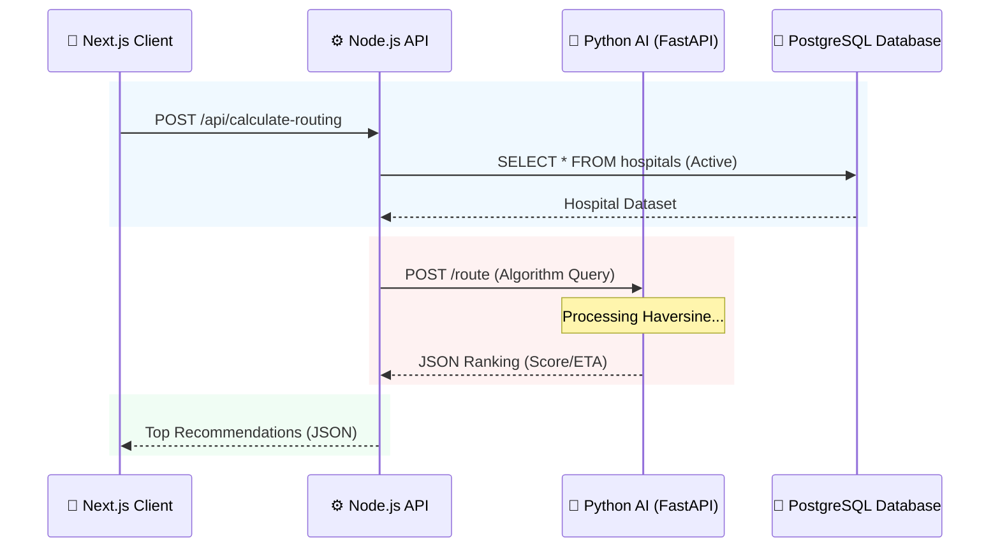

# 🔌 HealthBed AI API Documentation

> [!TIP]
> This document describes the REST API and WebSocket events for the HealthBed AI ecosystem. The core backend is built on **Node.js + Express**, while specialized routing is handled by the **FastAPI Python Microservice**.

---

## 🏗️ Core Backend API (Node.js)

### 📊 Hospital Directory

#### `GET /api/hospitals`
*   **Description:** Retrieve all registered hospitals with current live capacity.
*   **Response:** `200 OK`
    ```json
    [
      {
        "id": "uuid",
        "name": "Square Hospital",
        "lat": 23.7540,
        "lng": 90.3730,
        "available_beds": 42,
        "available_icu_beds": 8
      }
    ]
    ```

---

### 🏥 Hospital Management

#### `POST /api/beds/:hospitalId/adjust`
*   **Description:** Manually reconcile bed counts (Internal use: Hospital Admin).
*   **Auth Required:** Yes (Hospital Admin)
*   **Body:**
    ```json
    { "delta": -1, "type": "general" }
    ```
*   **Event:** Triggers `bedUpdate` WebSocket broadcast.

---

### 🚑 Emergency & Dispatch

#### `POST /api/dispatches`
*   **Description:** Initiate an emergency ambulance reservation.

---

## 🧠 AI Routing Service (FastAPI)

#### `POST /route`
*   **Description:** Calculated ranking of hospitals based on location and priority.
*   **Body:**
    ```json
    {
      "patient_location": { "lat": 23.7, "lng": 90.3 },
      "hospitals": [...]
    }
    ```

### 🛰️ Request Lifecycle Diagram



---

## 📡 Live Event-Bus (WebSockets)

| Event Name | Type | Data | Description |
| :--- | :--- | :--- | :--- |
| `bedUpdate` | Broadcast | `HospitalInfo` | Sent to all clients when any hospital capacity shifts. |
| `incomingAmbulance` | Room Target | `DispatchInfo` | Sent only to the specific Hospital Admin room. |

---

## 🚦 Error Reference

| Code | Meaning | Reason |
| :--- | :--- | :--- |
| `401` | Unauthorized | Valid JWT token missing or expired. |
| `403` | Forbidden | Role cannot access Admin endpoints. |
| `409` | Conflict | Pessimistic lock failed or bed is no longer available. |
| `422` | Validation Error | Improper JSON schema or invalid coordinates. |