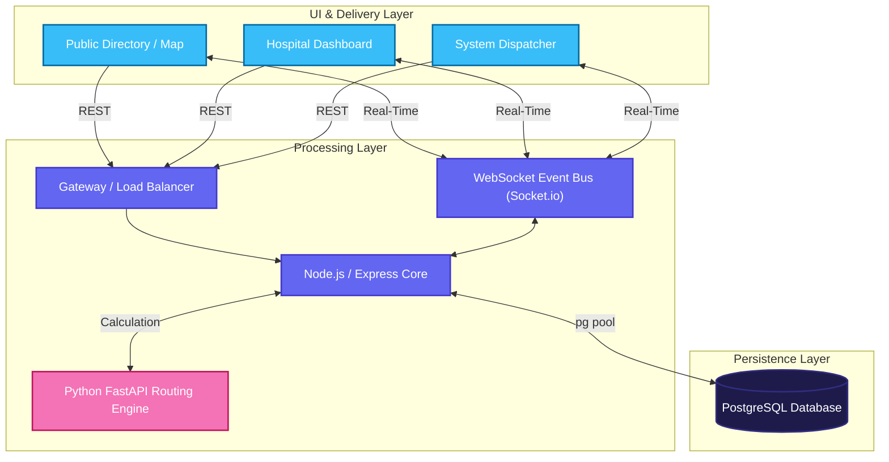

# System Architecture & Data Flow

> [!NOTE]
> HealthBed AI is built on a scalable, real-time event-driven architecture designed for high availability and low-latency updates across all connected clients.

---

## High-Level Architecture Diagram

---

## Core Operational Workflows

### 1. Real-Time Bed Availability Sync
1. **Hospital Administrator** updates bed capacities.
2. The mutation is submitted to the Node.js backend.
3. The backend updates the respective hospital record in PostgreSQL.
4. The Node.js controller triggers the `Socket.io` instance to emit a `bedUpdate` event.
5. **Result:** All connected clients receive the WebSocket event and the React state instantly synchronizes.

### 2. Autonomous Ambulance Dispatch & Reservation
> [!IMPORTANT]
> This flow utilizes strict database-level locking to prevent race conditions during emergencies.

1. **Dispatcher** initiates a dispatch sequence from the live map.
2. Request is dispatched to the backend `POST /api/dispatches`.
3. Backend initiates a **PostgreSQL Transaction**.
4. A pessimistic `SELECT ... FOR UPDATE` query locks the specific hospital row.
5. `Socket.io` fires `incomingAmbulance` alert to the target hospital.
6. **Result:** The Administrator's dashboard reflects an incoming critical alert.
