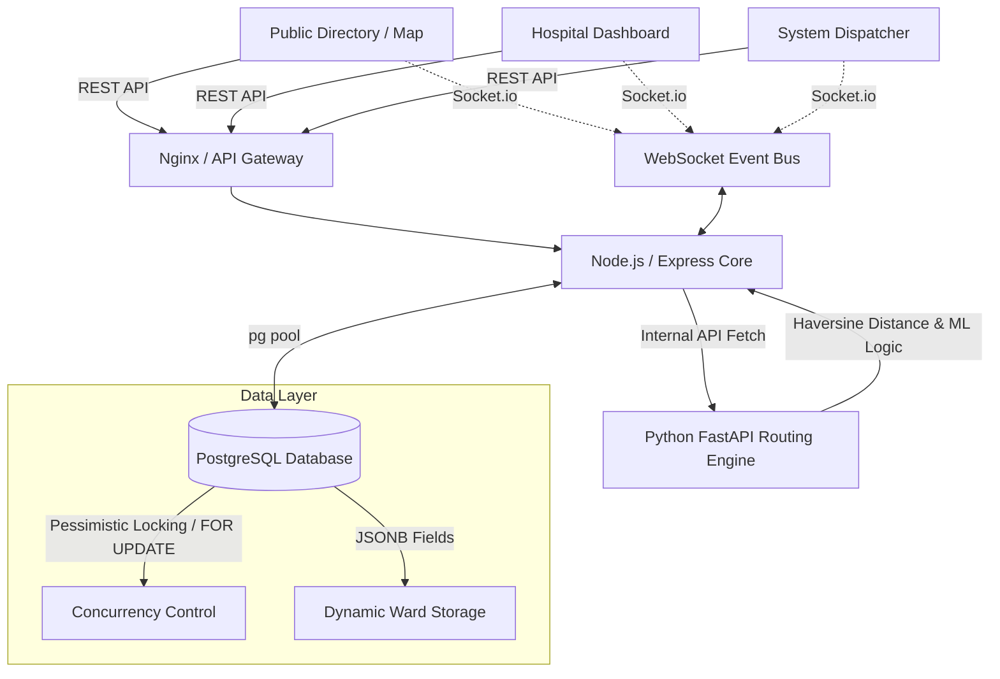

# 🏛️ System Architecture & Data Flow

> [!NOTE]
> HealthBed AI is built on a scalable, real-time event-driven architecture designed for high availability and millisecond-latency updates across all connected clients.

---

## 🗺️ High-Level Architecture Diagram

---

## ⚡ Core Operational Workflows

### 1. Real-Time Bed Availability Sync
1. **Hospital Admin** updates bed counts (General or ICU) via their dashboard.
2. The Action is sent to the Node.js backend.
3. Backend updates the specific hospital row in PostgreSQL.
4. An `INSERT` occurs in the `history_events` table to maintain an audit trail for analytics.
5. The Node.js controller triggers the `Socket.io` instance to emit a `bedUpdate` event containing the delta.
6. **Result:** All connected users (Public Map View and Patient Directory) receive the WebSocket event and the React state instantly updates rendering the new counts without a page refresh.

### 2. Autonomous Ambulance Dispatch & Reservation
> [!IMPORTANT]
> This flow utilizes strict database-level locking to prevent race conditions during emergencies.

1. **Dispatcher** clicks "Initiate Dispatch" from a specific hospital card on the live map.
2. Request travels to the backend `POST /api/dispatches`.
3. Backend initiates a **PostgreSQL Transaction**.
4. A pessimistic `SELECT ... FOR UPDATE` query locks the specific hospital row.
5. The system verifies if `availableBeds > 0`. If true, the bed is temporarily "reserved" by decrementing the count.
6. The transaction commits. A new dispatch record is saved.
7. `Socket.io` fires `incomingAmbulance` explicitly targeted to that Hospital Admin's WebSocket room.
8. **Result:** The Admin's dashboard flashes a pulsing red banner. Native browser Push Notifications fire instantly alerting them even if the tab is backgrounded.

### 3. Role-Based Access & System Admin Approval Flow
1. **New User** registers as `hospital_admin` via `/api/auth/signup`.
2. Backend assigns the user a `pending` status.
3. User attempts to login but receives a `403 Forbidden` until approved.
4. **System Administrator** logs in, pulls the `pending` list.
5. SysAdmin assigns a specific `hospital_id` via a secure dropdown and clicks **Approve**.
6. **Result:** The `pending` status updates to `approved` and their specific hospital is natively linked to their profile ID.
