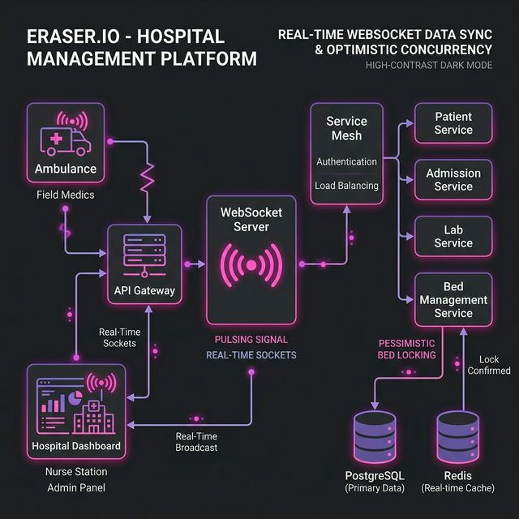
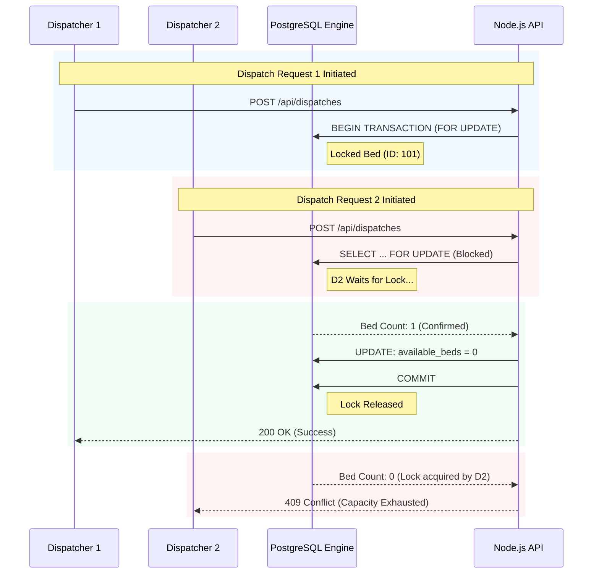
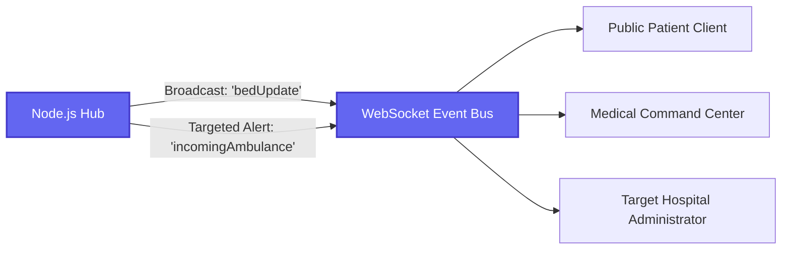

# System Design & Core Mechanisms




> [!TIP]
> To ensure absolute reliability in life-critical medical scenarios, HealthBed AI is engineered using modern, fail-safe system design principles. This document outlines the core technical mechanisms powering the framework.

---

## 1. Pessimistic Concurrency Control
*Preventing Resource Overbooking*

In a live-dispatch environment, multiple dispatchers might attempt to claim the exact same "last available bed" concurrently. Traditional SQL `SELECT` followed by `UPDATE` workflows suffer from race conditions resulting in critical over-booking.

### The Locking Flow Lifecycle



> [!NOTE]
> Because of the strict `FOR UPDATE` clause, PostgreSQL mathematically guarantees that any concurrent requests targeting a shared hospital record queue at the database level and process sequentially.

---

## 2. Real-Time WebSockets Engine
*Eliminating HTTP Polling Latency*

For true live situational awareness, standard HTTP polling (e.g., refreshing every 5 seconds) introduces unacceptable latency and resource overhead for emergency operations. HealthBed AI integrates `Socket.io` directly into the Node.js layer to establish persistent TCP bi-directional tunnels with all connected UI clients.

### WebSocket Topology



---

## 3. Client-Side Rendering vs SSR
*Dynamic Map Loading & Injection*

The Public Directory features a live, interactive map powered by `Leaflet` and `react-leaflet`. Since Leaflet directly manipulates the browser's `window` and `document` objects, it conflicts with Next.js Server-Side Rendering (SSR).

**Implementation:**
The system uses Next.js `dynamic` imports with `ssr: false` to guarantee the Map engine only initializes after the React lifecycle reaches the client environment.

```tsx
import dynamic from 'next/dynamic'

// Defers loading the heavier mapping library and prevents SSR hydration crashes
const HospitalMapClient = dynamic(() => import('./HospitalMapClient'), {
  ssr: false,
  loading: () => <MapSkeletonLoader />
});
```